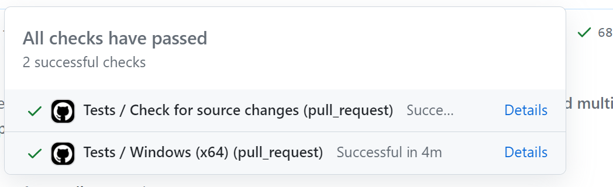
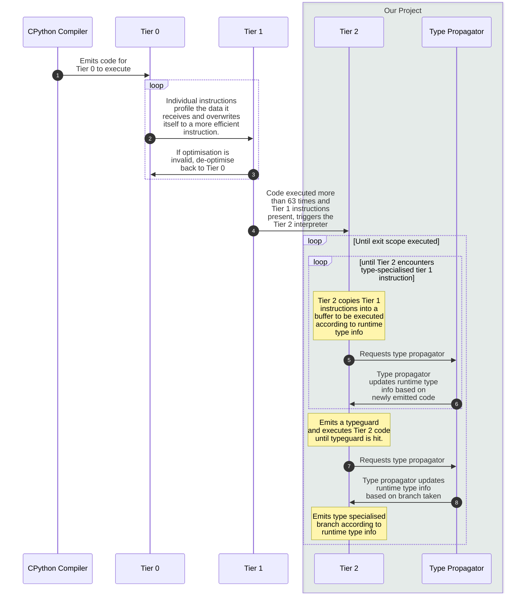

# pyLBBVAndPatch 

A WIP Lazy Basic Block Versioning + (eventually) Copy and Patch JIT Interpreter for CPython.

## Trying this project out

We provide pre-compiled binaries for 64-bit Windows 10/11 via [GitHub releases](https://github.com/pylbbv/pylbbv/releases/).

## The case for our project

Python is a widely-used programming language. As a Python user, I want CPython code to execute quicker.

CPython is Python's reference implementation. Due to Python’s dynamic type semantics, CPython is generally unable to execute Python programs as fast as it potentially could with static type semantics.

## The solution

We fork CPython to implement and experiment with features that will make it faster. Our fork is called pyLBBVAndPatch.

### Features

This section will be laden with some CS programming language terminology. We will do our best to keep that to a minimum and explain our features as simply as possible.

#### Pre-Orbital

Before Orbital, while taking CS4215 in the previous semester, we have already achieved the following:

- Lazy basic block versioning interpreter
- Basic type propagation
- Type check removal
- Basic tests
- Comprehensive documentation

In short, [lazy basic block versioning](https://arxiv.org/abs/1411.0352) is a technique for collecting type information of executing code. A *basic block* is a "is a straight-line code sequence with no branches in except to the entry and no branches out except at the exit" ([retrieved from Wikipedia, 21/6/2023](https://en.wikipedia.org/wiki/Basic_block)). The code you write usually consists of multiple basic blocks. Lazy basic block versioning means we only generate code at runtime, block by block, as we observe the types. This allows us to collect runtime type information at basic block boundaries and optimize our basic blocks we generate them.

Type propagation means we can take the type information gathered from a single basic block, and propagate them down to the next basic block. Thus over time we can accumulate more and more type information.

Type check removal means removing type checks in dynamic Python. E.g. if you have ``a + b``, the fast path in Python has to check that these are `int` or `str` or `float`, then if all those fail, rely on a generic `+` function. These type checks incur overhead at runtime. With type information, if we know the types, that we don't need any type checks at all! This means we can eliminate type checks.

We had a rudimentary test script and Doxygen documentation for all our functions to follow common SWE practices.

#### Orbital

This Orbital, we intend to refine pyLBBV. These include but are not limited to:
- [X] General refactoring
- [X] Bug fixing
- [X] A more advanced type propagator.
- [X] A more comprehensive test suite with Continuous Integration testing.
- [ ] A copy and patch JIT compiler.

A JIT(Just-in-Time) compiler is just a program that generates native machine executable code at runtime. [Copy and Patch](https://arxiv.org/abs/2011.13127) is a new fast compilation technique developed rather recently. The general idea is that compilation normally requires multiple steps, thus making compilation slow (recall how many steps your SICP meta-circular evaluator needs to execute JS)! Copy and patch makes compilation faster by skipping all the intermediate steps, and just creating "templates" for
the final code. These "templates" are called *stencils* and they contain *holes*, i.e. missing values. All you have to do for compilation now is to copy and template, and patch in the holes. Thus making it very fast!

The main copy and patch JIT compiler is writte by Brandt Bucher, and we plan on integrating his work with ours. However, as such a compiler is not designed for use with basic block versioning, we will be handwriting x64 assembly code to get things working!

Our work here will be made publically available so that it will benefit CPython and its users, and we plan to collaborate closely with the developers of CPython in the course of this project.

Due to Python being a huge language, pyLBBVAndPatch intends to support and optimise a subset of Python. Specifically pyLBBVAndPatch focuses on integer and float arithmetic. We believe this scope is sufficient as an exploration of the LBBV + Copy and Patch JIT approach for CPython.

##### General refactoring

We did a major refactor of our code generation machinery. This makes the code easier to reason about.


##### Bug fixing

- We managed to support recursive functions in Python!
- We are now able to build ourselves using the standard Python build suite. This is a huge accomplishment because it requires supporting a lot of Python code.
- We have fixed enough bugs that we can now run complex recursive Python functions like `help(1)`.


##### A more advanced type propagator

- We fixed bugs with how one type context (i.e snapshot) is deemed to be compatible with another type context.
- We now support collecting negative type information (e.g. that a variable is not and `int` or not `float`). This allows for better type check elimination.


##### SWE dev best practices and CI testing

- We have added both feature tests and regression tests to our test script in [tier2_test.py](./tier2_test.py).
- We now have continous integration. We build our project and run tests using GitHub Actions for Windows 64-bit, on every pull request and commit to the repository!

- All PRs require review and an approval before merging is allowed. All tests in CI must also pass. This follows standard best practices.

## Architecture Diagram and Design



## What's left for our project

- The Copy and Patch JIT compiler.

## Evaluation and benchmarks

We will run the [bm_nbody.py](./bm_nbody.py) script and the [bm_float_unboxed.py](./bm_float_unboxed.py) to gather results. For now we expect performance to have no improvement as we have yet to implement the copy and patch JIT compiler.

## Changelog over CS4215

* Refactor: Typeprop codegen by @JuliaPoo in https://github.com/pylbbv/pylbbv/pull/1
    * Refactored type propagation codegen to more explicitly align with the formalism in our [technical report (Appendix)](https://github.com/pylbbv/pylbbv/blob/pylbbv/report/CPython_Tier_2_LBBV_Report_For_Repo.pdf) and remove duplicated logic
    * Fixed bug with possible reference cycle in the type propagation `TYPE_SET` operation
* feat: granular type checks by @Fidget-Spinner in https://github.com/pylbbv/pylbbv/pull/2
    * Split `BINARY_CHECK_X` into simply `CHECK_X` and short-circuit failure paths. This allows us to follow more closely to the LBBV paper. It also means we can supported cases where one operand is known but the other unknown.
* Perf: Improved typeprop by switching overwrite -> set by @JuliaPoo in https://github.com/pylbbv/pylbbv/pull/6
    * Stricter type propagation reduces type information loss
* Improved support for Tier 2 code generation
    * Insert cache entries for `SUBSCR` tier 2 instructions in https://github.com/pylbbv/pylbbv/pull/13
    * Fixed off by one error in forward jump calculation in https://github.com/pylbbv/pylbbv/pull/19
    * Fixed wrong offset in `BB_BRANCH_IF_FLAG_SET` codegen in https://github.com/pylbbv/pylbbv/pull/21
    * Fixed `BB_TEST_POP_IF_FALSE` not setting flag in https://github.com/pylbbv/pylbbv/pull/24
    * Recursive generation of basic blocks in https://github.com/pylbbv/pylbbv/pull/29
    * Mark interpreter frames as tier 2 or not in https://github.com/pylbbv/pylbbv/pull/34
    * Make instruction offset calculation frame aware in https://github.com/pylbbv/pylbbv/pull/37
    * Support multiple entry points in a Basic Block in https://github.com/pylbbv/pylbbv/pull/39 and https://github.com/pylbbv/pylbbv/pull/40
    * `BINARY_OP` specialisations now apply to `PySmallInt_Type` in https://github.com/pylbbv/pylbbv/pull/46
* Improved workflow:
    * workflow: enable CI GH actions tests in https://github.com/pylbbv/pylbbv/pull/35
* Improved type propagator:
    * Store negative/inverted types in type propagator nodes in https://github.com/pylbbv/pylbbv/pull/36
        * Note: This eliminates the Ladder guards mentioned in our previous technical report.
    * Fixed backward jump type context compatibility check in https://github.com/pylbbv/pylbbv/pull/10

## Build instructions

You should follow the official CPython build instructions for your platform.
https://devguide.python.org/getting-started/setup-building/

During the build process, errors may be printed, and the build process may error. However,
the final Python executable should still be generated.

## Where are files located? Where is documentation?

The majority of the changes and functionality are in `Python/tier2.c` where Doxygen documentation
is written alongside the code, and in `Tools/cases_generator/` which contains the DSL implementation.

## Running tests

We've written simple tests of the main functionalities.
Unfortunately we did not have time to write comprehensive tests, and it doesn't seem worth it eitherways given the experimental nature of this project.

After building, run `python tier2_test.py` or `python.bat tier2_test.py` (on Windows)  in the repository's root folder.

## Debugging output

In `tier2.c`, two flags can be set to print debug messages:
```c
// Prints codegen debug messages
#define BB_DEBUG 0

// Prints typeprop debug messages
#define TYPEPROP_DEBUG 0
```

## Addendum

More details can be found in our [technical report](https://github.com/pylbbv/pylbbv/blob/pylbbv/report/CPython_Tier_2_LBBV_Report_For_Repo.pdf). For an introduction to pyLBBV, refer to our [presentation](https://docs.google.com/presentation/d/e/2PACX-1vQ9eUaAdAgU0uFbEkyBbptcLZ4dpdRP-Smg1V499eogiwlWa61EMYVZfNEXg0xNaQvlmdNIn_07HItn/pub?start=false&loop=false&delayms=60000). 
